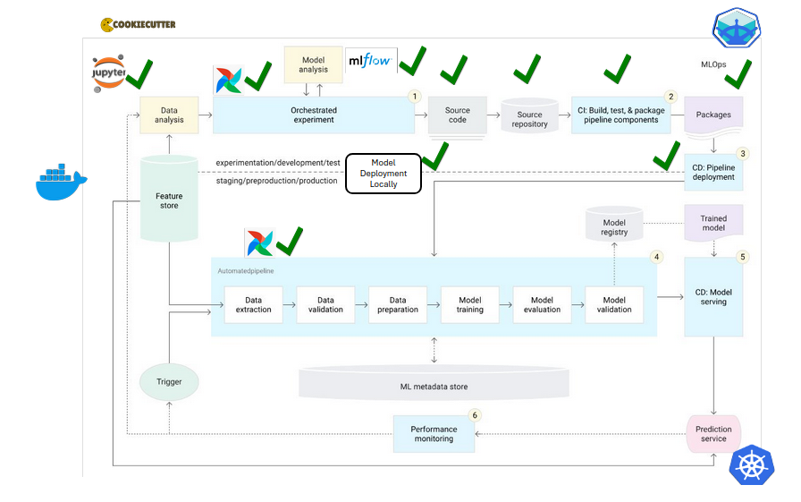

# GaiaFlow: MLOps Project Template

[](https://github.com/bcdev/gaiaflow/actions/workflows/unittest.yml)
[](https://github.com/charliermarsh/ruff)
[](https://bcdev.github.io/gaiaflow/)


<sub>(Image created using ChatGPT)</sub>

The word `GaiaFlow` is a combination of `Gaia` (the Greek goddess of Earth, symbolizing our planet) 
and `Flow` (representing seamless workflows in MLOps). It is an MLOps 
framework tailored for efficient Earth Observation projects. GaiaFlow is built 
to provide you with a framework for the entire pipeline of remote sensing applications, from data 
ingestion to machine learning modeling to deploying them.

It is a comprehensive template for machine learning projects
providing a MLOps framework with tools like `Airflow`, `MLFlow`, 
`JupyterLab`, `Minio` and `Minikube` to allow the user to create ML projects, 
experiments, model deployments and more in an standardized way. The documentation
is available [here](https://bcdev.github.io/gaiaflow/)


The architecture below describes what we want to achieve as our MLOps framework.
This is taken from the [Google Cloud Architecture Centre](https://cloud.google.com/architecture/mlops-continuous-delivery-and-automation-pipelines-in-machine-learning#mlops_level_2_cicd_pipeline_automation)

Currently what we support is the shown as green ticks.



**Please note**: 
This framework has only been tested on Linux Ubuntu and Windows 11 and it works 
as expected.
As we have not tested it yet on MacOS, we are not sure if it works in there.

# Table of Contents
- [Overview](#overview)
- [Project Structure from this template.](#project-structure-from-this-template)
- [ML Pipeline Overview](#ml-pipeline-overview)
  * [0. Cookiecutter](#0-cookiecutter)
  * [1. Apache Airflow](#1-apache-airflow)
    + [Airflow UI](#airflow-ui)
  * [2. MLflow](#2-mlflow)
    + [MLFlow UI](#mlflow-ui)
  * [3. JupyterLab](#3-jupyterlab)
  * [4. MinIO](#4-minio)
- [Getting Started](#getting-started)
  * [Prerequisites](#prerequisites)
    + [Docker and Docker compose plugin Installation](#docker-and-docker-compose-plugin-installation)
  * [Installation](#installation)
- [Troubleshooting](#troubleshooting)
- [Acknowledgments](#acknowledgments)

## Overview

This template provides a standardized project structure for ML initiatives at 
BC, integrating essential MLOps tools:
- **Apache Airflow**: For orchestrating ML pipelines and workflows
- **MLflow**: For experiment tracking and model registry
- **JupyterLab**: For interactive development and experimentation
- **MinIO**: For local object storage for ML artifacts
- **Minikube**: For local lightweight Kubernetes cluster

## Project Structure from this template

You will get the following project when you use this template to get started with
your ML project.

Any files or folders marked with `*` are off-limits—no need to change, modify, 
or even worry about them. Just focus on the ones without the mark!

Any files or folders marked with `^` can be extended, but carefully.
```
├── .github/             # GitHub Actions workflows (you are provided with a starter CI)
├── dags/                # Airflow DAG definitions 
│                          (you can either define dags using a config-file (dag-factory)
│                           or use Python scripts.)
├── notebooks/           # JupyterLab notebooks
├── your_package/                  
│   │                     (For new projects, it would be good to follow this standardized folder structure.
│   │                      You are of course allowed to add anything you like to it.)
│   ├── dataloader/      # Your Data loading scripts
│   ├── train/           # Your Model training scripts
│   ├── preprocess/      # Your Feature engineering/preprocessing scripts
│   ├── postprocess/     # Your Postprocessing model output scripts
│   ├── model/           # Your Model defintion
│   ├── model_pipeline/  # Your Model Pipeline to be used for inference
│   └── utils/           # Utility functions
├── tests/               # Unit and integration tests
├── data/                # If you have data locally, move it here and use it so that airflow has access to it.
├── README.md            # Its a readme. Feel to change it!
├── CHANGES.md           # You put your changelog for every version here.
├── pyproject.toml       # Config file containing your package's build information and its metadata
├── .env * ^             # Your environment variables that docker compose and python scripts can use (already added to .gitignore)
├── .gitignore * ^       # Files to ignore when pushing to git.
├── environment.yml      # Libraries required for local mlops and your project
├── mlops_manager.py *   # Manager to manage the mlops services locally
├── minikube_manager.py *# Manager to manage the kubernetes cluster locally 
├── docker-compose.yml * # Docker compose that spins up all services locally for MLOps
├── utils.py *           # Utility function to get the minikube gateway IP required for testing.
├── docker_config.py *   # Utility function to get the docker image name based on your project.
├── kube_config_inline * # This file is needed for Airflow to communicate with Minikube when testing locally in a prod env.
└── dockerfiles/ *       # Dockerfiles and compose files
```


## MLOps Components

Before you get started, let's explore the tools that we are using for this 
standardized MLOps framework 

### 0. Cookiecutter
Purpose: Project scaffolding and template generation

- Provides a standardized way to create ML projects with predefined structures.
- Ensures consistency across different ML projects within BC


### 1. Apache Airflow

Purpose: Workflow orchestration

- Manages and schedules data pipelines.
- Automates end-to-end ML workflows, including data ingestion, training, deployment and re-training.
- Provides a user-friendly web interface for tracking task execution's status.

#### Airflow UI

https://github.com/user-attachments/assets/b7a76c27-2f38-489f-9798-d0af4ac7619b

- **DAGs (Directed Acyclic Graphs)**: A workflow representation in Airflow. You 
can enable, disable, and trigger DAGs from the UI.
- **Graph View**: Visual representation of task dependencies.
- **Tree View**: Displays DAG execution history over time.
- T**ask Instance**: A single execution of a task in a DAG.
- **Logs**: Each task's execution details and errors.
- **Code View**: Shows the Python code of a DAG.
- **Trigger DAG**: Manually start a DAG run.
- **Pause DAG**: Stops automatic DAG execution.

Common Actions

- **Enable a DAG**: Toggle the On/Off button.
- **Manually trigger a DAG**: Click Trigger DAG ▶️.
- **View logs**: Click on a task instance and select Logs.
- **Restart a failed task**: Click Clear to rerun a specific task.

### 2. MLflow

Purpose: Experiment tracking and model management

- Tracks and records machine learning experiments, including hyperparameters, performance metrics, and model artifacts.
- Facilitates model versioning and reproducibility.
- Supports multiple deployment targets, including cloud platforms, Kubernetes, and on-premises environments.

#### MLFlow UI

https://github.com/user-attachments/assets/5c639c34-cba2-4682-a2ed-6a854e9386c1

- **Experiments**: Group of runs tracking different versions of ML models.
- **Runs**: A single execution of an ML experiment with logged parameters, 
metrics, and artifacts.
- **Parameters**: Hyperparameters or inputs logged during training.
- **Metrics**: Performance indicators like accuracy or loss.
- **Artifacts**: Files such as models, logs, or plots.
- **Model Registry**: Centralized storage for trained models with versioning.

Common Actions

- **View experiment runs**: Go to Experiments > Select an experiment
- **Compare runs**: Select multiple runs and click Compare.
- **View parameters and metrics**: Click on a run to see details.
- **View registered model**: Under Artifacts, select a model and click Register 
Model.

### 3. JupyterLab

Purpose: Interactive development environment

- Provides an intuitive and interactive web-based interface for exploratory data analysis, visualization, and model development.

### 4. MinIO

Purpose: Object storage for ML artifacts

- Acts as a cloud-native storage solution for datasets and models.
- Provides an S3-compatible API for seamless integration with ML tools.

### 5. Minikube

Purpose: Local Kubernetes cluster for development & testing

- Allows you to run a single-node Kubernetes cluster locally.
- Simulates a production-like environment to test Airflow DAGs end-to-end.
- Great for validating KubernetesExecutor, and Dockerized task behavior before deploying to a real cluster.
- Mimics production deployment without the cost or risk of real cloud infrastructure.


## Getting Started

Please make sure that you install the following from the links provided as they
have been tried and tested.

If you face any issues, please check out the [troubleshooting section](#troubleshooting)

### Prerequisites

- Docker and Docker Compose
- [Mamba](https://github.com/conda-forge/miniforge) - Please make sure you 
install `Python 3.12` as this repository has been tested with that version.
- [Minikube on Linux](https://minikube.sigs.k8s.io/docs/start/?arch=%2Flinux%2Fx86-64%2Fstable%2Fbinary+download)
- [Minikube on Windows](https://minikube.sigs.k8s.io/docs/start/?arch=%2Fwindows%2Fx86-64%2Fstable%2F.exe+download)

#### Docker and Docker compose plugin Installation

For Linux users: please follow the steps mentioned in this [link](https://docs.docker.com/engine/install/ubuntu/#install-using-the-repository)

For Windows users: please follow the steps mentioned in this [link](https://docs.docker.com/desktop/setup/install/windows-install/)

This should install both Docker and Docker compose plugin.
You can verify the installation by these commands
```bash
   docker --version
   docker compose version
```
and output would be something like:
```commandline
  Docker version 27.5.1, build 9f9e405
  Docker Compose version v2.32.4
```
This means now you have successfully installed Docker. 


Once the pre-requisites are done, you can go ahead with the project creation:

1. Create a separate environment for cookiecutter
```bash
  mamba create -n cc cookiecutter ruamel.yaml
  mamba activate cc
```

2. Generate the project from template:
```bash
  cookiecutter https://github.com/bcdev/gaiaflow
```

When prompted for input, enter the details requested. If you dont provide any 
input for a given choice, the first choice from the list is taken as the default.

Once the project is created, please read the README.md from that.


## Troubleshooting
0. If you are windows, please use the `miniforge prompt` commandline.

1. If you face issue like `Docker Daemon not started`, start it using:
```bash
  sudo systemctl start docker
```
and try the docker commands again in a new terminal.


2. If you face an issue as follows:
`Got permission denied while trying to connect to the Docker daemon socket at 
unix:///var/run/docker.sock: `,
do the following
```bash
  sudo chmod 666 /var/run/docker.sock
```
and try the docker commands again in a new terminal.


3. If you face an issue like
`Cannot connect to the Docker daemon at unix:///home//.docker/desktop/docker.sock. 
Is the docker daemon running?`,
it is likely because of you have two contexts of docker running.

To view the docker contexts,
```bash
   docker context ls
```
This will show the list of docker contexts. Check if default is enabled (it 
should have a * beside it)
If not, you might probably have desktop as your context enabled.
To confirm which context you are in:
```bash
   docker context show
```

To use the default context, do this:
```bash
   docker context use default
```

Check for the following file:
```bash
  cat ~/.docker/config.json
```
If it is empty, all good, if not, it might be something like this:
```
  {
	"auths": {},
	"credsStore": "desktop"
  }
```
Completely move this file away from this location or delete it and try running 
docker again.

4. If you face some permissions issues on some files like `Permission Denied`, 
as a workaround, please use this and let us know so that we can update this 
repo.
```bash
  sudo chmod 666 <your-filename> 
```

If you face any other problems not mentioned above, please reach out to us.


## Acknowledgments

- [Cookiecutter](https://github.com/cookiecutter/cookiecutter)
- [Apache Airflow](https://airflow.apache.org/)
- [MLflow](https://mlflow.org/)
- [Minio](https://min.io/docs/minio/container/index.html)
- [JupyterLab](https://jupyterlab.readthedocs.io/)
- [Minikube](https://minikube.sigs.k8s.io/docs/)
