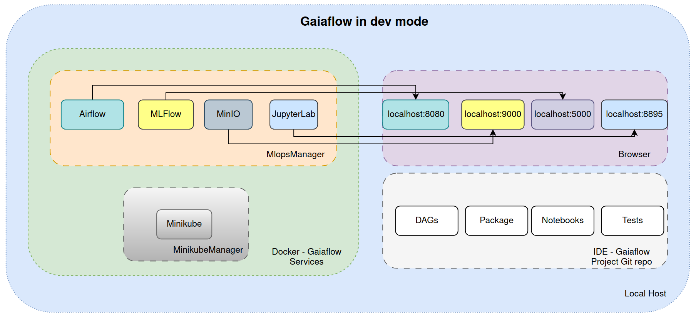
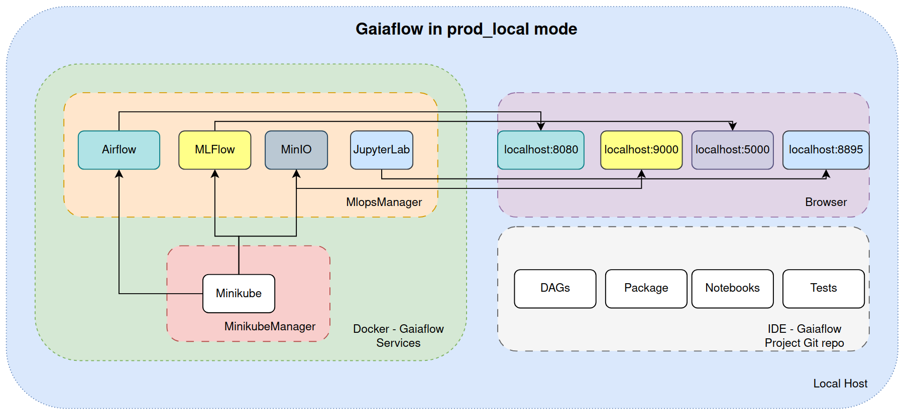
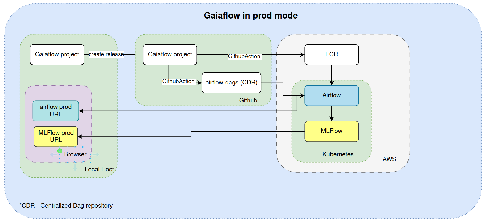
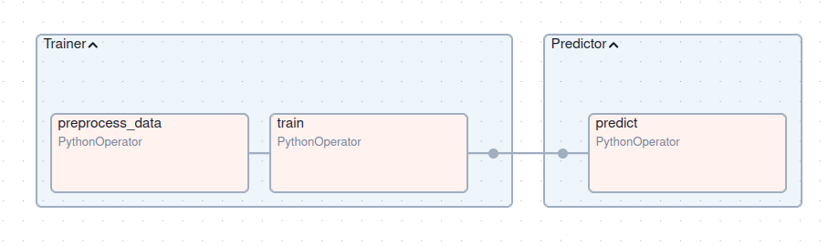
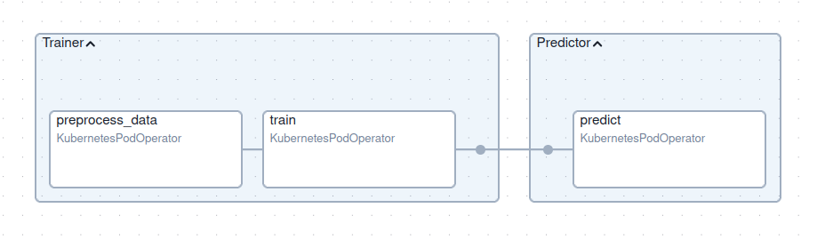

# Getting Started with GaiaFlow

This guide will help you set up your environment, install dependencies, and generate your first project using the GaiaFlow template.

The following section provides an overview of the services provided
by the Gaiaflow framework.
For first-time users, we recommend that you read/skim through this
to get an idea of what Gaiaflow can currently offer.

If you would like to start, then [get started here](#getting-started)

---

## Architecture





The Gaiaflow environment provides a modular, local-first MLOps setup, enabling
rapid development and production-like testing of Airflow DAGs.

| Service           | Description                                                                                                     |
|-------------------| --------------------------------------------------------------------------------------------------------------- |
| `MlopsManager`    | Spins up MLOps services (Airflow, MLflow, etc.) for **local development**.                                      |
| `MinikubeManager` | Spins up a **local Kubernetes cluster** for **testing DAGs in a production-like environment** before deploying. |


### MlopsManager

Manages local MLOps components for day-to-day development and experimentation.


| Service     | Description                                | Default Port(s)              |
| ----------- | ------------------------------------------ | ---------------------------- |
| **Airflow** | DAG orchestration & scheduling platform    | `8080` (Web UI)              |
| **MLflow**  | ML lifecycle management (tracking, models) | `5000` (UI & API)            |
| **MinIO**   | Object storage (S3-compatible)             | `9000` (S3 API), `9001` (UI) |

#### When to Use It

Use Mlops Manager when:

- You are testing Jupyter code with MLFlow/Minio
- You're iterating on pipeline code after creating your software package.
- You want to test Airflow DAGs, Jupyter notebooks, or other services locally.
- You need fast feedback loops before deploying to Minikube or production.
- You are using `task_factory` in `dev` mode

#### CLI Reference


```bash
python gaiaflow_manager.py [OPTIONS]
```

| Flag / Option           | Description                                     | Example                     |
| ----------------------- | ----------------------------------------------- |-----------------------------|
| `--start`               | Start selected services                         | `--start --service airflow` |
| `--stop`                | Stop selected services                          | `--stop --service mlflow`   |
| `--restart`             | Restart selected services                       | `--restart --service airflow`                |
| `--service`             | Choose service: `airflow`, `mlflow`, `jupyter`  | `--service jupyter`         |
| `-c`, `--cache`         | Use Docker cache during image builds            | `--start -c`                |
| `-j`, `--jupyter-port`  | Port to expose Jupyter Notebook (default: 8895) | `--start -j 8896`           |
| `-v`, `--delete-volume` | Delete Docker volumes on shutdown               | `--stop -v`                 |
| `-b`, `--docker-build`  | Force rebuild Docker image                      | `--start -b`                |


### MinikubeManager

Used to create a lightweight local Kubernetes cluster that simulates production,
for validating DAGs using KubernetesExecutor or custom pods.

| Component    | Description                           |
| ------------ | ------------------------------------- |
| **Minikube** | Local, single-node Kubernetes cluster |


#### When to Use It

Use Minikube Manager when:

- You want to test Docker images and airflow tasks in a local Kubernetes environment.
- You’re preparing for deployment to production Airflow on AWS.
- You're using `task_factory` in `prod_local` mode.

#### CLI Reference

```bash
python minikube_manager.py [OPTIONS]
```

| Flag / Option          | Description                                                  | Example                |
| ---------------------- |--------------------------------------------------------------| ---------------------- |
| `--start`              | Start the Minikube cluster                                   | `--start`              |
| `-s`, `--stop`         | Stop the Minikube cluster                                    | `-s`                   |
| `-r`, `--restart`      | Restart the Minikube cluster                                 | `-r`                   |
| `--build-only`         | Only build the Docker image inside the Minikube context      | `--build-only`         |
| `--create-config-only` | Generate inline config for use in Docker Compose             | `--create-config-only` |
| `--create-secrets`     | (might be removed) Create Kubernetes secrets for use in pods | `--create-secrets`     |


#### Managing Secrets (TODO: talk with Tejas)

You can now create any secrets dynamically:

```python
create_secrets(secret_name="my-creds", secret_data={"API_KEY": "1234", "ENV": "dev"})
```

This creates Kubernetes secrets inside the Minikube cluster.

**Best Practice:** Use environment variables or secure vaults in production. Avoid hardcoding secrets.

#### Image Naming Best Practices  (TODO: talk with Tejas)

We recommend using:

```text
<project-name>/<package-name>:<version>
```

Where `version` is fetched from your Python package's `__version__`.


## Overview

This template provides a standardized project structure for ML initiatives at 
BC, integrating essential MLOps tools:

- **Apache Airflow**: For orchestrating ML pipelines and workflows
- **MLflow**: For experiment tracking and model registry
- **JupyterLab**: For interactive development and experimentation
- **MinIO**: For local object storage for ML artifacts
- **Minikube**: For local lightweight Kubernetes cluster


## MLOps Components

Before you get started, let's explore the tools that we are using for this 
standardized MLOps framework 

### 0. Cookiecutter
Purpose: Project scaffolding and template generation

- Provides a standardized way to create ML projects with predefined structures.
- Ensures consistency across different ML projects within BC


### 1. Apache Airflow

Purpose: Workflow orchestration

- Manages and schedules data pipelines.
- Automates end-to-end ML workflows, including data ingestion, training, deployment and re-training.
- Provides a user-friendly web interface for tracking task execution's status.


#### Key Concepts in Airflow

##### DAG (Directed Acyclic Graph)
A DAG is a collection of tasks organized in a structure that reflects their 
execution order. DAGs do not allow for loops, ensuring deterministic scheduling 
and execution.

##### Task
A Task represents a single unit of work within a DAG. Each task is an instance
of an **Operator**. Gaiaflow provides [task_factory](#6-task-factory) for the
ease of defining tasks in a DAG.

##### Operator
Operators define the type of work to be done. They are templates that 
encapsulate logic.

Common Operators:

- **PythonOperator**: Executes a Python function.

- **BashOperator**: Executes bash commands.

- **KubernetesPodOperator**: Executes code inside a Kubernetes pod.

- **DummyOperator**: No operation — used for DAG design.

For ease of use of Airflow, we have created a wrapper `task_factory` that 
allows the user to create these tasks without worrying about which operator to
use. Read more [here](#task-factory)

##### Scheduler
The scheduler is responsible for triggering DAG runs based on a schedule. 
It evaluates DAGs, resolves dependencies, and queues tasks for execution.

##### XCom (Cross-Communication)
A lightweight mechanism for passing small data between tasks. Data is stored 
in Airflow’s metadata DB and fetched using Jinja templates or Python.


#### Airflow UI

- **DAGs (Directed Acyclic Graphs)**: A workflow representation in Airflow. You 
can enable, disable, and trigger DAGs from the UI.
- **Graph View**: Visual representation of task dependencies.
- **Tree View**: Displays DAG execution history over time.
- T**ask Instance**: A single execution of a task in a DAG.
- **Logs**: Each task's execution details and errors.
- **Code View**: Shows the Python code of a DAG.
- **Trigger DAG**: Manually start a DAG run.
- **Pause DAG**: Stops automatic DAG execution.

Common Actions

- **Enable a DAG**: Toggle the On/Off button.
- **Manually trigger a DAG**: Click Trigger DAG ▶️.
- **View logs**: Click on a task instance and select Logs.
- **Restart a failed task**: Click Clear to rerun a specific task.

### 2. MLflow

Purpose: Experiment tracking and model management

- Tracks and records machine learning experiments, including hyperparameters, performance metrics, and model artifacts.
- Facilitates model versioning and reproducibility.
- Supports multiple deployment targets, including cloud platforms, Kubernetes, and on-premises environments.


#### Core Components

##### Tracking
Allows logging of metrics, parameters, artifacts, and models for every 
experiment.

##### Models
MLflow models are saved in a standard format that supports deployment to 
various serving platform.

##### Model Registry
Central hub for managing ML models where one can register and version models.


#### MLFlow UI

- **Experiments**: Group of runs tracking different versions of ML models.
- **Runs**: A single execution of an ML experiment with logged parameters, 
metrics, and artifacts.
- **Parameters**: Hyperparameters or inputs logged during training.
- **Metrics**: Performance indicators like accuracy or loss.
- **Artifacts**: Files such as models, logs, or plots.
- **Model Registry**: Centralized storage for trained models with versioning.

Common Actions

- **View experiment runs**: Go to Experiments > Select an experiment
- **Compare runs**: Select multiple runs and click Compare.
- **View parameters and metrics**: Click on a run to see details.
- **View registered model**: Under Artifacts, select a model and click Register 
Model.

For a quick MLFLow tutorial, see more [here](tutorial.md)

### 3. JupyterLab

Purpose: Interactive development environment

- Provides an intuitive and interactive web-based interface for exploratory data analysis, visualization, and model development.

### 4. MinIO

Purpose: Object storage for ML artifacts

- Acts as a cloud-native storage solution for datasets and models.
- Provides an S3-compatible API for seamless integration with ML tools.
- Suitable for Local development iterations using a portion of the data

### 5. Minikube

Purpose: Local Kubernetes cluster for development & testing

- Allows you to run a single-node Kubernetes cluster locally.
- Simulates a production-like environment to test Airflow DAGs end-to-end.
- Great for validating KubernetesExecutor, and Dockerized task behavior before deploying to a real cluster.
- Mimics production deployment without the cost or risk of real cloud infrastructure.


### 6. Task Factory
#### Purpose
Since this template is mainly for Python related packages, to make it easier 
for users adopting airflow, we provide `task_factory` which is a unified task generator that abstracts away the complexity 
of choosing the right Airflow operator depending on the deployment environment 
(`dev`, `prod_local`, or `prod`). Its goal is to:

- Simplify task definitions
- Enable environment switching (`dev`, `prod`, `prod_local`)
- Unify local Python-based execution and Kubernetes-based execution
- Support **XCom pulling**, **secret injection**, and **environment variables**

So users will use `task_factory` to create tasks in an Airflow DAG.

**NOTE**: This however does not restrict the user from using a different operator of 
their choice, but they would need to make sure that it works in both 
`dev` and `prod` mode.

#### Task factory parameters
| Parameter         | Type   | Description                                                           |
|-------------------|--------|-----------------------------------------------------------------------|
| `task_id`         | `str`  | Unique task identifier in all modes                                   |
| `func_path`       | `str`  | Module path to the function (e.g., `my.module:func`)   in all modes   |
| `func_kwargs`     | `dict` | Function arguments   in all modes                                     |
| `image`           | `str`  | Docker image to use in `prod`/`prod_local` mode                       |
| `env`             | `str`  | One of `dev`, `prod`, `prod_local`                                    |
| `xcom_push`       | `bool` | Whether to push result to XCom  in all modes                          |
| `xcom_pull_tasks` | `dict` | Tasks and keys to pull from XCom  in all modes                        |
| `secrets`         | `list` | Kubernetes secret names in `prod`/`prod_local` mode                   |
| `env_vars`        | `dict` | Extra environment variables in `prod`/`prod_local` mode               |
| `retries`         | `int`  | Number of times the task must be retried. Default is 2. For all modes |

#### Behavior by Environment:

##### `dev` mode:

- Local development mode.
- Uses PythonOperator.
- Fastest for iteration.
- Only `task_id`, `func_path`, `func_kwargs`, and `env` are used.
- `image`, `secrets`, `env_vars` are ignored.



##### `prod_local` mode:

- Simulates production on your machine using `Minikube` + `KubernetesPodOperator`.
  
- Requires:
   - `image`: Docker image (built locally from your project).
   - `secrets`: For injecting secure credentials (e.g., to connect to MinIO or databases).
   - `env_vars`: Environment-specific config (e.g., MLFLOW and S3 URIs).
   - You must run `MinikubeManager` beforehand



##### `prod` mode:
- Uses `KubernetesPodOperator`
- Production environment in AWS Kubernetes cluster.
- Same requirements as `prod_local`, but deployed to remote infra.

#### Use cases for environments:

| Environment  | Use Case                                                                                   |
| ------------ |--------------------------------------------------------------------------------------------|
| `dev`        | Local testing with `PythonOperator` (no Docker or Kubernetes needed)                       |
| `prod_local` | Testing production-like behavior on your machine via Minikube with `KubernetesPodOperator` |
| `prod`       | Fully production environment on Kubernetes  with `KubernetesPodOperator`                    |


#### Supported Operators:

| Operator                | Used In              | Purpose                                                          |
| ----------------------- | -------------------- |------------------------------------------------------------------|
| `PythonOperator`        | `dev`                | Runs functions directly in the scheduler                         |
| `KubernetesPodOperator` | `prod_local`, `prod` | Runs tasks in isolated Docker containers via Kubernetes/Minikube |


#### secrets
- Used only in `prod_local` and `prod` modes.
- Reference to Kubernetes secrets.
- Passed to `KubernetesPodOperator` to inject secure credentials (e.g., MinIO 
  access keys).
- Defined in your Kubernetes environment (Minikube or production cluster).
- Injected as environment variables using `env_from`. 

#### env_vars
- Used only in `prod_local` and `prod` modes.
- Dictionary of environment variables needed at runtime.
- Used to connect to services like:
   - MLflow Tracking Server (`MLFLOW_TRACKING_URI`)
   - MinIO or S3-compatible storage (`MLFLOW_S3_ENDPOINT_URL`)
- In prod_local, these point to your local Minikube (e.g., `192.168.49.1`).
- In prod, they point to production service URLs.

#### XCom Support (For all modes)

You can pass results between tasks using `xcom_pull_tasks`, regardless of mode.
It is used to pull data from the output (return_value) of a previous task using 
Airflow’s XCom (Cross-Communication) mechanism.

**NOTE**:
- In `dev`, values are pulled directly from Airflow’s XCom system.
- In `prod`/`prod_local`, values are injected into the pod as environment 
variables using templated Jinja strings and parsed at runtime by your 
application.


#### Structure:

```bash
xcom_pull_tasks={
    "argument_name": {
        "task": "<task_group.task_id>" | "<task_id>",  # Fully qualified task name. include task group if any
        "key": "return_value",  # Optional, defaults to return_value
    },
}
```

- The keys in the dictionary become arguments passed to your function.
- The value is a reference to another task's output (via XCom).
- It works in all modes (dev, prod_local, prod), because task_factory handles 
 the internals.

Example:

```bash
xcom_pull_tasks={
    "preprocessed_path": {
        "task": "Trainer.preprocess_data",
        "key": "return_value"
    }
}
```
This pulls the result of `preprocess_data` from the `Trainer` task group and 
passes it to the function that is invoked in the task.


## Getting Started

Please make sure that you install the following from the links provided as they
have been tried and tested.

If you face any issues, please check out the [troubleshooting section](#troubleshooting)

### Prerequisites

- Docker and Docker Compose
- [Mamba](https://github.com/conda-forge/miniforge) - Please make sure you 
install `Python 3.12` as this repository has been tested with that version.
- [Minikube on Linux](https://minikube.sigs.k8s.io/docs/start/?arch=%2Flinux%2Fx86-64%2Fstable%2Fbinary+download)
- [Minikube on Windows](https://minikube.sigs.k8s.io/docs/start/?arch=%2Fwindows%2Fx86-64%2Fstable%2F.exe+download)

#### Docker and Docker compose plugin Installation

For Linux users: please follow the steps mentioned in this [link](https://docs.docker.com/engine/install/ubuntu/#install-using-the-repository)

For Windows users: please follow the steps mentioned in this [link](https://docs.docker.com/desktop/setup/install/windows-install/)

This should install both Docker and Docker compose plugin.
You can verify the installation by these commands
```bash
   docker --version
   docker compose version
```
and output would be something like:
```commandline
  Docker version 27.5.1, build 9f9e405
  Docker Compose version v2.32.4
```
This means now you have successfully installed Docker. 


Once the pre-requisites are done, you can go ahead with the project creation:

1. Create a separate environment for cookiecutter
```bash
  mamba create -n cc cookiecutter ruamel.yaml
  mamba activate cc
```

2. Generate the project from template:
```bash
  cookiecutter https://github.com/bcdev/gaiaflow
```

When prompted for input, enter the details requested. If you dont provide any 
input for a given choice, the first choice from the list is taken as the default.

Once the project is created, please follow along [here](dev.md).


## Troubleshooting
0. If you are windows, please use the `miniforge prompt` commandline.

1. If you face issue like `Docker Daemon not started`, start it using:
```bash
  sudo systemctl start docker
```
and try the docker commands again in a new terminal.


2. If you face an issue as follows:
`Got permission denied while trying to connect to the Docker daemon socket at 
unix:///var/run/docker.sock: `,
do the following
```bash
  sudo chmod 666 /var/run/docker.sock
```
and try the docker commands again in a new terminal.


3. If you face an issue like
`Cannot connect to the Docker daemon at unix:///home//.docker/desktop/docker.sock. 
Is the docker daemon running?`,
it is likely because of you have two contexts of docker running.

To view the docker contexts,
```bash
   docker context ls
```
This will show the list of docker contexts. Check if default is enabled (it 
should have a * beside it)
If not, you might probably have desktop as your context enabled.
To confirm which context you are in:
```bash
   docker context show
```

To use the default context, do this:
```bash
   docker context use default
```

Check for the following file:
```bash
  cat ~/.docker/config.json
```
If it is empty, all good, if not, it might be something like this:
```
  {
	"auths": {},
	"credsStore": "desktop"
  }
```
Completely move this file away from this location or delete it and try running 
docker again.

4. If you face some permissions issues on some files like `Permission Denied`, 
as a workaround, please use this and let us know so that we can update this 
repo.
```bash
  sudo chmod 666 <your-filename> 
```

If you face any other problems not mentioned above, please reach out to us.


